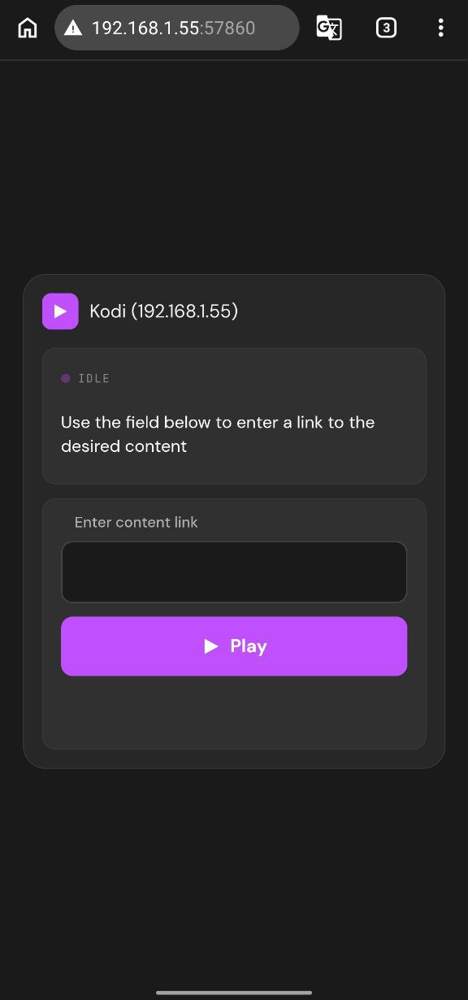
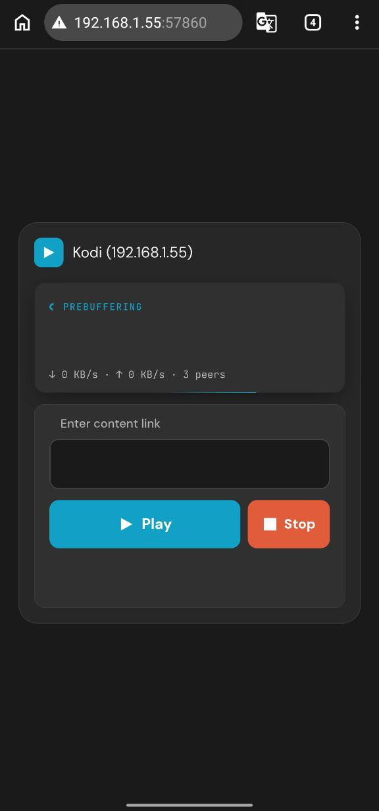
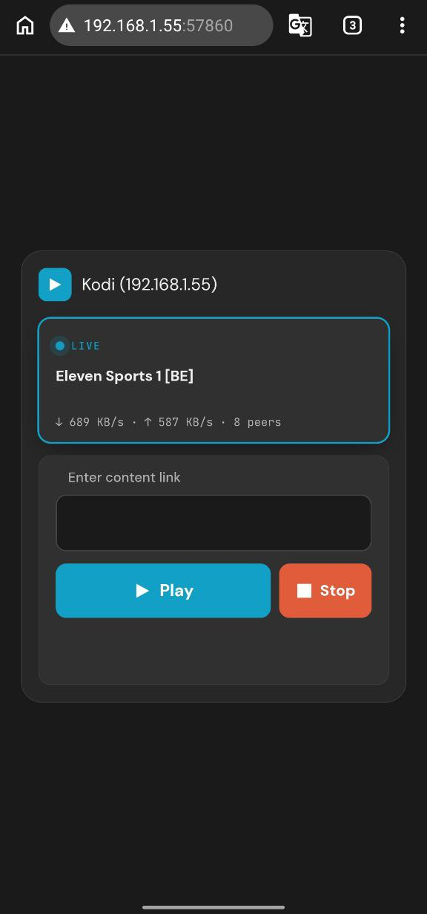

# AceViewer — Ace Stream Browser Control for Kodi

  

A lightweight Kodi service addon that lets you control Ace Stream playback from any browser on your local network — no remote needed. Pure Python, no dependencies, minimal resource usage.

## Features

- **Browser control** — open the web interface from any device on your network
- **QR code** — scan to instantly open the control page on your phone
- **Live status** — see what's playing, buffering state, download/upload speed and peer count in real time
- **Play & Stop** — paste an Ace Stream ID and start playback directly from your phone or PC browser
- **Accent color** — the web interface automatically picks up your Kodi skin's accent color
- **Lightweight** — tiny footprint, runs entirely in the background with negligible CPU and memory usage

## Screenshots

  
  
  

## Requirements

- Kodi 20 (Nexus) or later
- **Ace Stream Engine** (official or unofficial client) running on the same or another device on your network
- No external Python dependencies — pure Python addon

## Installation

1. Download the latest `service.aceviewer.zip` from the [Releases](../../releases) page
2. In Kodi: **Settings → Add-ons → Install from zip file**
3. Select the downloaded zip
4. Go to **Settings → Add-ons → My add-ons → Services → AceViewer**
5. Open addon settings:
   - Enable **Browser control**
   - Set the **port** (default: 57860)
   - Set **Engine IP** and **Engine port** to match your Ace Stream Engine
6. Press **Show QR code** to get the web interface address

## Usage

1. Open the web interface by scanning the QR code or navigating to `http://YOUR_KODI_IP:57860` in any browser
2. Paste an Ace Stream content ID or `acestream://` link into the field
3. Press **Play** — Kodi will start playback automatically
4. Press **Stop** to end the stream

## Configuration

| Setting | Default | Description |
|---|---|---|
| Enable browser control | Off | Enables the HTTP server |
| Port | 57860 | Port for the web interface |
| Engine IP | 127.0.0.1 | IP address of Ace Stream Engine |
| Engine port | 6878 | Port of Ace Stream Engine API |

## License

MIT

